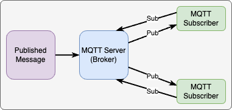

# Digital-Twin-Foundations
To cover my foundational learning of IOT integrated digital twin technologies.


# Task 1
First task was to create a relationship between 2 nodes, the MQTT publisher and MQTT subscriber, both done with Mosquitto MQTT. To do this I started a repo and began drafting how I'd do this task, with 2 vagrant-defined VMs and a playbook to provision both of them (to a state where I could start playing around with them).

The relationship between the nodes looks like this:



To do this I deployed config from the `mqtt` role in ``


Then to send a test message from the publisher to the subscriber I first started the subscriber on the "test" topic (`-t test`) from the mosquitto_sub cli via `mosquitto_sub -t test` to start listening.

Then from the broker I used the mosquitto_pub cli to send a message via the same "test" topic using `-t test` on the mosquitto_pub cli I used `mosquitto_pub -h 10.0.1.11 -t test -m "Demo"`

This resulted in the following on both VMs:
```
alex@mqtt1-u:/etc$ mosquitto_pub -h 10.0.1.11 -t test -m "Demo"
```

```
alex@mqtt2-u:/etc/mosquitto$ mosquitto_sub -t test
Demo
```

Following the guidance from these pages:
* http://www.steves-internet-guide.com/mqtt-basics-course/
* https://www.hivemq.com/blog/mqtt-essentials-part-4-mqtt-publish-subscribe-unsubscribe/

